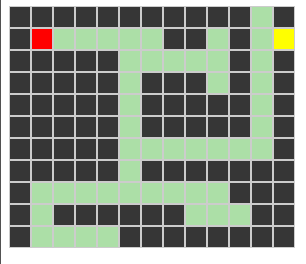

# AMAZEing

Let's build a simple Maze program. You start from a defined position, you're supposed to get the treasure.

- Type of challenge: `consolidation`  
- Duration: `1-2 days`  
- Team challenge: `solo`

## Learning objectives

- Using loops and the DOM to generate simple templates. 
- Using keyboard events
- Think of problems as algorithms

## The mission

- Create a new repository named `amazeing`
- Create a new javascript file.
- Create a file named `index.html`. In the `<body>` you can only put an empty `<main>` tag, and the link to your javascript file. The rest of the app has to be generated using your script
- Use [this file](mazes.js) as a reference to build a maze. `*` are walls, `.` are paths, `S` is the starting point of the player and `T` is the treasure you should reach in order to end the game. 
- Create a `maze.css` file, you'll have to create styles for the 2 types of terrain (walls and paths), it can be simple background colors for starter.
- Using the keyboard you can navigate in the maze (you can only stay on paths, you cannot cross walls)

The first level looks like this (starting as a red tile, treasure as a yellow tile)

Don't hesitate to be creative on the styles:

> A maze built by Madeline

## BONUS

- Try to implement the next levels, so when you finished a maze a new one pops up.
- You could also create levels of your own
- Display the time spent to solve the maze
- Make it pretty!
